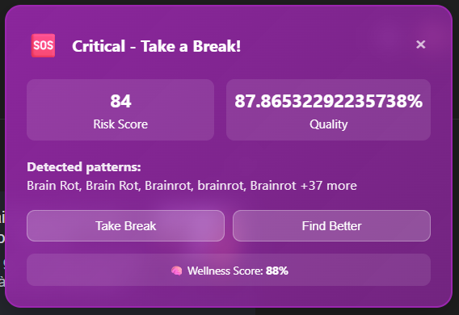
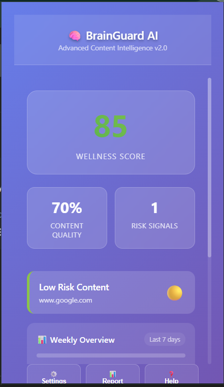
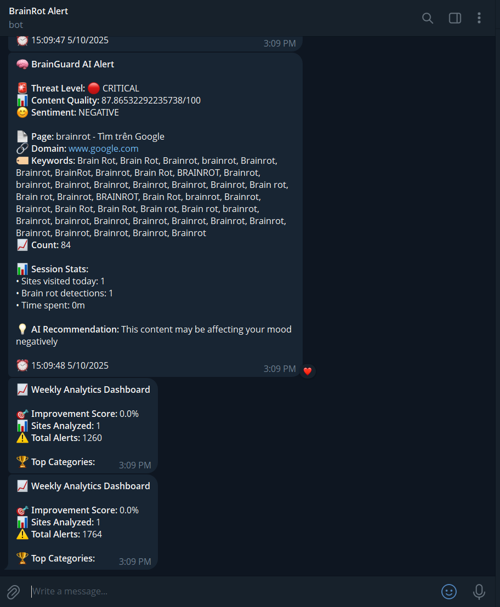

# 🧠 BrainRot Alert

> A browser extension that helps you recognize and control your "brainrot" content consumption habits on social media.

[](https://opensource.org/licenses/MIT)
[](https://github.com/TaiThanhhhh/BrainRot-Alert)
[](https://chrome.google.com/webstore)

## 📖 About The Project

BrainRot Alert is a browser extension designed to help users identify and minimize time spent consuming low-quality content on social media platforms. The extension monitors your browsing habits and provides alerts when it detects signs of "brainrot" content consumption.

### Why BrainRot Alert?

- **Take control** of your digital wellness and productivity
- **Track** your content consumption patterns with detailed analytics
- **Break** the cycle of endless scrolling and mindless content consumption
- **Improve** focus and mental clarity by reducing exposure to low-quality content

### ✨ Key Features

- 🔔 **Real-time Alerts**: Get notifications when browsing brainrot content for too long
- 📊 **Detailed Statistics**: View daily/weekly/monthly reports of your content consumption
- 🎯 **Customizable Sensitivity**: Adjust alert thresholds based on your needs
- 🚫 **Website Blocking**: Automatically block brainrot sites after a set time limit
- 📈 **Goal Setting**: Set daily limits and track your progress
- 🌙 **Focus Mode**: Enable strict blocking during work/study hours
- 📱 **Telegram Integration**: Receive instant alerts on your mobile device
- 🔐 **Privacy First**: All data stored locally on your device

### 🛠️ Built With

- JavaScript (ES6+)
- Chrome Extension API / WebExtensions API
- HTML5 & CSS3
- Telegram Bot API

## 📸 Screenshots

### Extension Popup Interface


*Main extension popup showing current status, settings, and quick actions*

### Browser Notification Alert


*Real-time browser notification when brainrot content is detected*

### Telegram Alert Notification


*Instant Telegram message alert sent to your mobile device when excessive brainrot is detected*

## 🚀 Getting Started

### Prerequisites

- Google Chrome browser (version 88 or higher)
- OR Firefox browser (version 85 or higher)
- OR Microsoft Edge browser (version 88 or higher)
- (Optional) Telegram account for mobile notifications

### Installation

#### From Chrome Web Store (Coming Soon)

The extension will be available on the Chrome Web Store soon.

#### Manual Installation (Development)

1. Clone the repository

git clone https://github.com/TaiThanhhhh/BrainRot-Alert.git

2. Navigate to the project directory

cd BrainRot-Alert


3. Load the extension in Chrome
- Open Chrome and navigate to `chrome://extensions/`
- Enable "Developer mode" in the top right corner
- Click "Load unpacked"
- Select the `brainrot-alert-extension-advanced` folder from the cloned repository

4. The extension icon should now appear in your browser toolbar

### Setting Up Telegram Notifications (Optional)

1. Open Telegram and search for [@BotFather](https://t.me/botfather)
2. Create a new bot using `/newbot` command
3. Copy your bot token
4. Click the extension icon and go to Settings
5. Paste your bot token in the "Telegram Integration" section
6. Get your Chat ID by messaging your bot and visiting `https://api.telegram.org/bot<YOUR_BOT_TOKEN>/getUpdates`
7. Enter your Chat ID in the extension settings
8. Save and test the connection

## 💡 Usage

### Basic Usage

1. **First Time Setup**: Click the extension icon and configure your preferences
2. **Set Your Limits**: Define daily time limits for different content categories
3. **Browse Normally**: The extension runs in the background monitoring your activity
4. **Receive Alerts**: Get notified via browser notifications and Telegram when you've spent too much time on brainrot content

### Configuration Options

- **Alert Frequency**: Choose how often you want to receive warnings
- **Block List**: Add specific websites or content types to monitor
- **Quiet Hours**: Set times when alerts should be disabled
- **Statistics**: View your browsing patterns in the dashboard
- **Telegram Integration**: Enable mobile notifications through Telegram bot
- **Notification Types**: Choose between browser notifications, Telegram alerts, or both

## 📁 Project Structure
```bash
BrainRot-Alert/
└── brainrot-alert-extension-advanced/
├── icons/
│ ├── icon-16.png
│ ├── icon-48.png
│ └── icon-128.png
├── background.js
├── content.css
├── content.js
├── manifest.json
├── popup.html
├── popup.js
└── README.md
```


## 🗺️ Roadmap

- [x] Basic content monitoring
- [x] Alert notifications
- [x] Custom popup interface
- [x] Browser notification system
- [x] Telegram bot integration
- [x] Statistics dashboard
- [x] Multi-browser support (Firefox, Edge)
- [ ] AI-powered content classification
- [ ] Sync settings across devices
- [ ] Integration with productivity tools
- [ ] Discord webhook support
- [ ] Export usage reports

See the [open issues](https://github.com/TaiThanhhhh/BrainRot-Alert/issues) for a full list of proposed features and known issues.

## 🤝 Contributing

Contributions are what make the open source community such an amazing place to learn, inspire, and create. Any contributions you make are **greatly appreciated**.

If you have a suggestion that would make this better, please fork the repo and create a pull request. You can also simply open an issue with the tag "enhancement".

1. Fork the Project
2. Create your Feature Branch (`git checkout -b feature/AmazingFeature`)
3. Commit your Changes (`git commit -m 'Add some AmazingFeature'`)
4. Push to the Branch (`git push origin feature/AmazingFeature`)
5. Open a Pull Request

### Development Guidelines

- Follow the existing code style
- Write clear commit messages
- Update documentation as needed
- Test your changes thoroughly before submitting
- Add screenshots for UI changes

## 📄 License

Distributed under the MIT License. See `LICENSE` for more information.

## 👤 Author

**TaiThanh**

- GitHub: [@TaiThanhhhh](https://github.com/TaiThanhhhh)
- Repository: [BrainRot-Alert](https://github.com/TaiThanhhhh/BrainRot-Alert)

## 🙏 Acknowledgments

- [Chrome Extension Documentation](https://developer.chrome.com/docs/extensions/)
- [MDN Web Extensions](https://developer.mozilla.org/en-US/docs/Mozilla/Add-ons/WebExtensions)
- [Telegram Bot API](https://core.telegram.org/bots/api)
- [Best README Template](https://github.com/othneildrew/Best-README-Template)
- [Shields.io](https://shields.io) - For README badges
- All contributors who have helped improve this project

## 📞 Support

If you encounter any issues or have questions:

- 🐛 [Report a Bug](https://github.com/TaiThanhhhh/BrainRot-Alert/issues)
- 💡 [Request a Feature](https://github.com/TaiThanhhhh/BrainRot-Alert/issues)
- ⭐ Star this repo if you find it useful!

## 🔒 Privacy Policy

BrainRot Alert respects your privacy:

- All data is stored **locally** on your device
- No data is sent to external servers (except Telegram if enabled)
- No tracking or analytics
- No personal information is collected
- Telegram bot token and chat ID are stored locally and encrypted

---

<p align="center">Made with ❤️ by TaiThanh</p>
<p align="center">Fighting brainrot, one alert at a time! 🧠✨</p>


